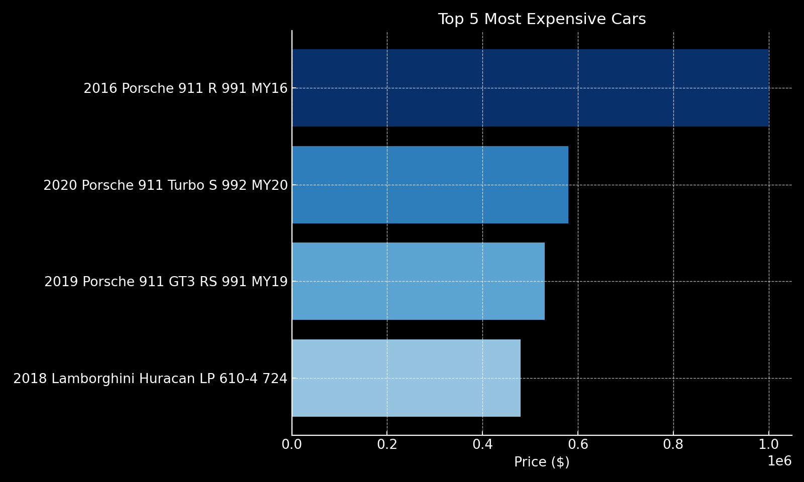
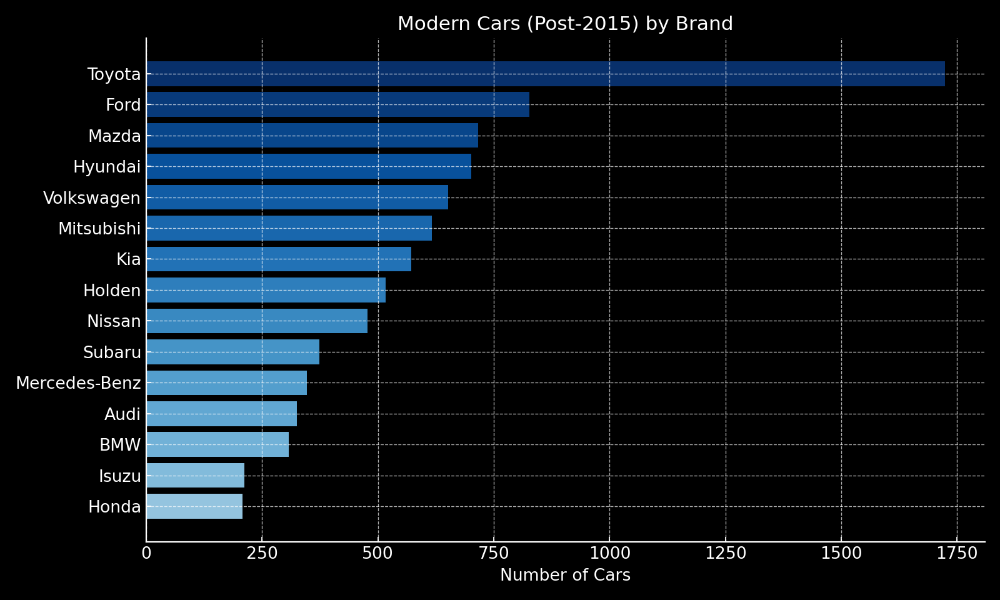
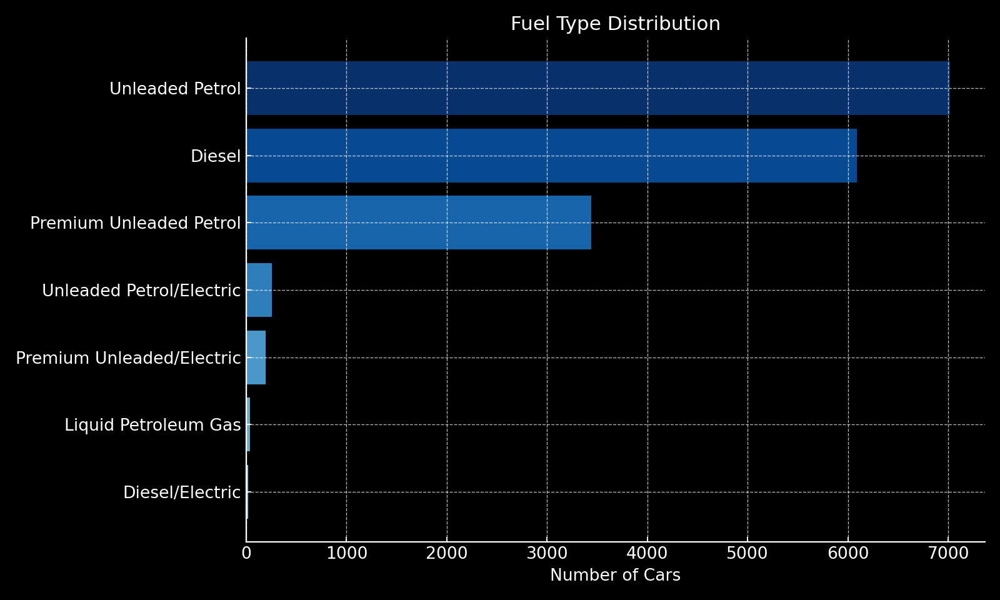
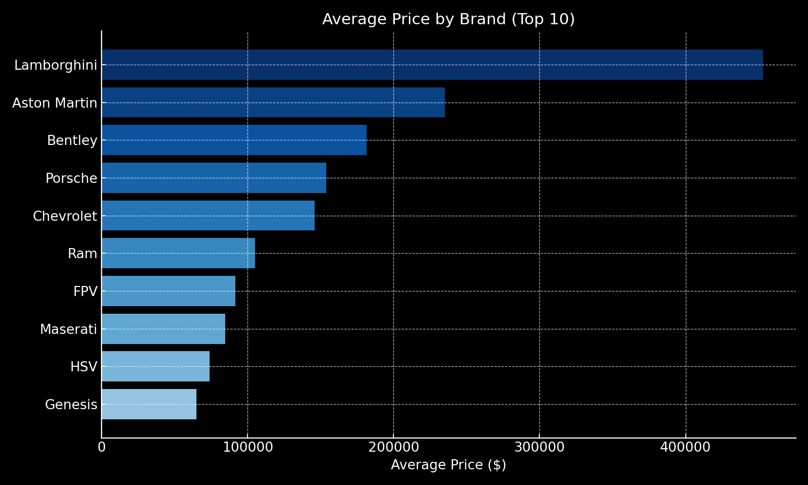
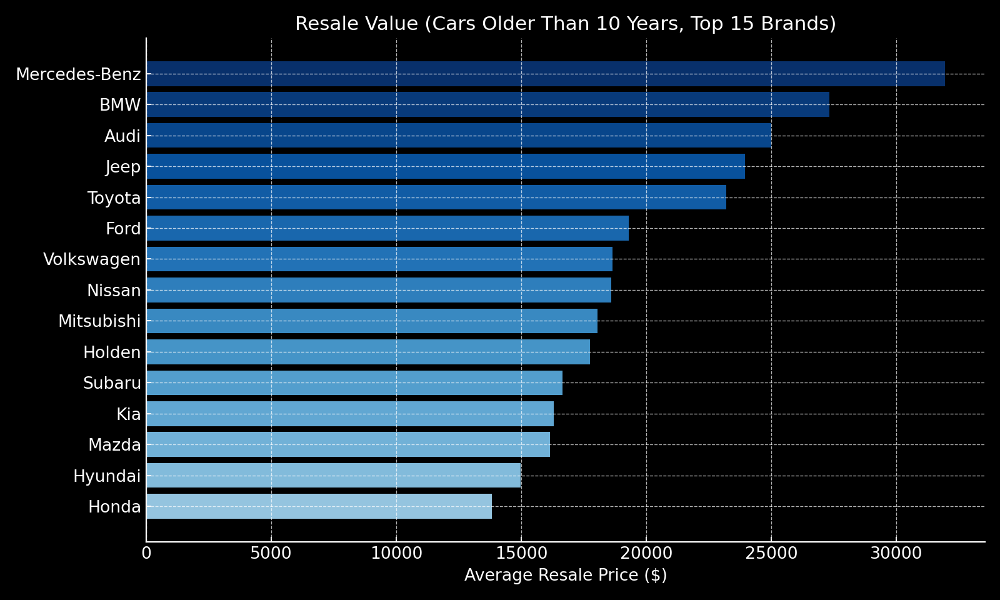
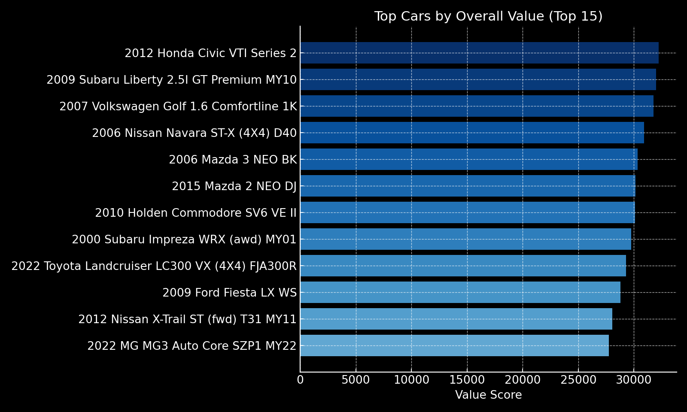

  

# 🚗 Australian Car Dataset – SQL Insights  

---

## 📊 Introduction  
This project analyzes the **Australian Car Dataset** using **MySQL**, with the goal of **generating insights** that help automakers, dealerships, and buyers understand 💰 pricing trends, 🏆 brand performance, and 📈 market opportunities.  

🔍 SQL queries? Check them out in the [`queries/`](Queries) folder. 

🔍 Dataset Link - "https://www.kaggle.com/datasets/lainguyn123/australia-car-market-data/data"

---

## 🗂️ Background  
The dataset includes details such as **brand, model, year, kilometers, price, type, and fuel**.  
With SQL, I explored questions like:  

- What are the **most expensive cars** in Australia?  
- Which brands dominate in **modern car availability**?  
- How are **fuel types** distributed across the market?  
- Which brands command **premium average prices**?  
- Which brands retain the best **resale value**?  
- What are the **best overall value cars**?  

---

## ⚙️ Tools I Used  
- 🛢️ **MySQL** → data queries and insights  
- 💻 **Visual Studio Code** → SQL execution  
- 🗂️ **Git & GitHub** → project versioning and sharing  

---

## 🔍 Key Analysis & Insights  

### 1. Top 5 Most Expensive Cars  
  
💡 **Insights:**  
- Luxury European brands dominate the **premium car segment**.  
- Most expensive listings exceed **$600,000**, reflecting niche luxury markets.  
- A sharp contrast with brand averages shows significant **price inequality**.  
- Highlights automakers’ positioning in the **ultra-luxury range**.  

---

### 2. Modern Cars (Post-2015) by Brand  
  
💡 **Insights:**  
- Toyota, Mazda, and Hyundai dominate **modern vehicle availability**.  
- Reflects strong focus on **fuel-efficient and newer models**.  
- Luxury brands trail behind in post-2015 offerings.  
- Suggests where dealerships can focus for **modern inventory turnover**.  

---

### 3. Fuel Type Distribution  
  
💡 **Insights:**  
- Petrol accounts for the **majority of listings**, followed by diesel.  
- Hybrids and EVs are a **small but emerging segment**.  
- Shows Australia’s **slower EV adoption** compared to global markets.  
- Critical input for **automakers planning fuel strategy investments**.  

---

### 4. Average Price by Brand (Top 10)  
  
💡 **Insights:**  
- Premium European brands (**Mercedes, BMW, Audi**) dominate price averages.  
- Mass-market brands fall far below, showing **clear segmentation**.  
- Strong price leadership reflects **brand equity and consumer trust**.  
- Confirms luxury brands’ dominance in the **high-value car market**.  

---

### 5. Resale Value (Cars Older Than 10 Years)  
  
💡 **Insights:**  
- Toyota and Lexus lead in **resale value retention**.  
- High resale reflects strong **reliability perception**.  
- Key driver of purchase decisions in the **used-car market**.  
- Automakers can leverage this in **marketing campaigns**.  

---

### 6. Top Cars by Overall Value  
  
💡 **Insights:**  
- Balancing **price, age, and mileage**, Japanese brands dominate.  
- These cars reflect the **best deals for budget-conscious buyers**.  
- Value cars offer **practical alternatives** to luxury vehicles.  
- Insightful for dealerships targeting **cost-sensitive market segments**.  

---

## 🏁 Closing Thoughts  
This project demonstrates how **SQL can turn raw automotive data into actionable insights**.  
By identifying trends in pricing, brand performance, fuel adoption, and resale value, the analysis supports data-driven decision-making for automakers and dealerships.  

---
